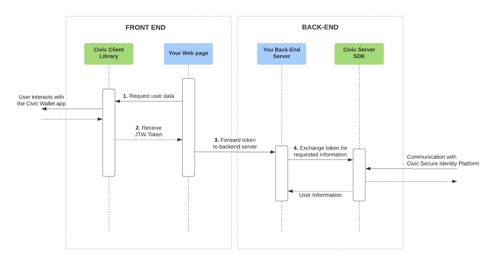

# Integration Overview

1. On your front-end, initiate a new request for user data using the Civic front-end library.&#x20;
2. After the user shares their data via their Civic Wallet app, the Civic front-end library returns a JWT token to your front-end.&#x20;
3. Your front-end forwards the JWT token to your back-end.&#x20;
4. From your back-end, using the Civic server SDK, exchange the JWT token for the requested verified user information.


You will need a free [<mark style="color:orange;">Civic Integration Portal</mark>](https://integrate.civic.com/) account to access Civic services. Basic signup & login requests are enabled by default while access to our KYC/Proof of Identity service requires Civic approval. You can request access to our KYC service through the integration portal.


