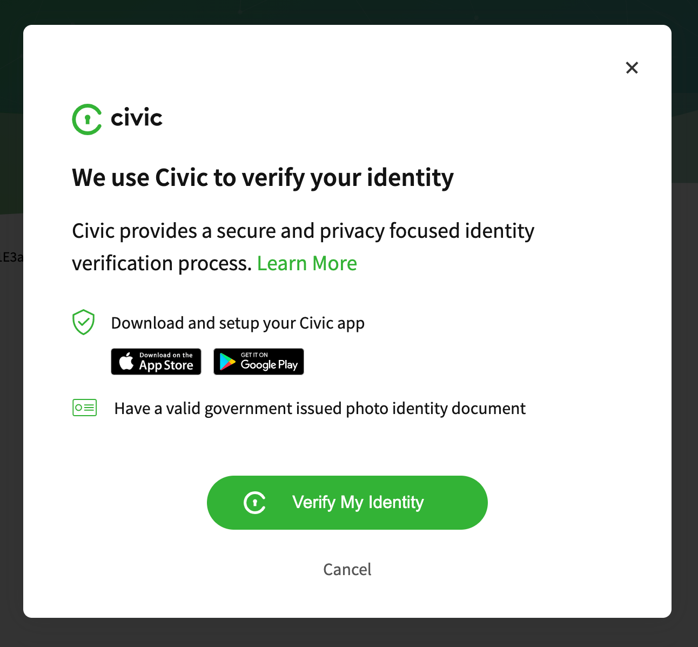
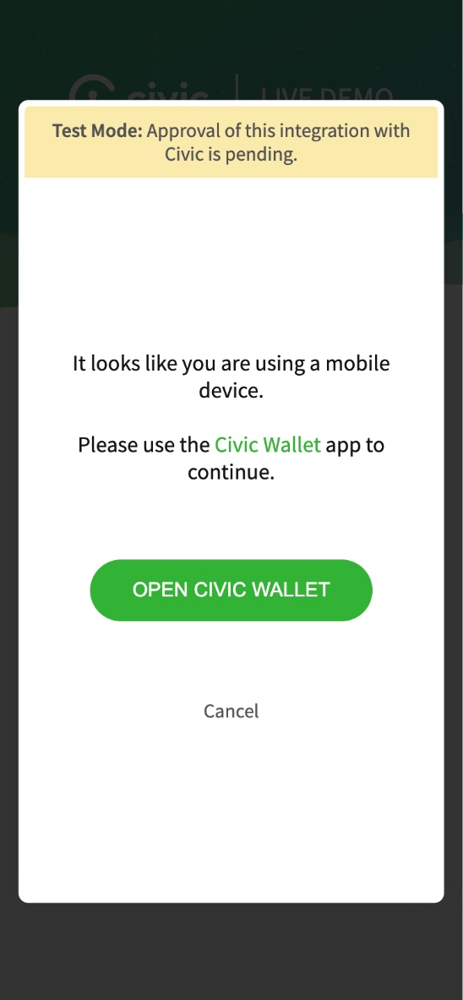

# Scope Request Types

### BASIC\_SIGNUP <a href="#basic_signup" id="basic_signup"></a>

The BASIC\_SIGNUP scope request returns the user’s basic account info - email and phone. It is most commonly used for secure login and signup solutions when no additional identity verification is required.

```
 civicSip.signup({
   style: 'popup',
   scopeRequest: civicSip.ScopeRequests.BASIC_SIGNUP
 });
```


#### USER DATA RETURNED <a href="#user-data-returned" id="user-data-returned"></a>

| Label                  | Example Value        | Description                                                                                                                                                                      |
| ---------------------- | -------------------- | -------------------------------------------------------------------------------------------------------------------------------------------------------------------------------- |
| contact.personal.email | jonsmith@example.com | The user's verified email.                                                                                                                                                       |
| isValid                | true                 | Civic SIP service checks whether or not the data is still considered valid on the blockchain.                                                                                    |
| isOwner                | true                 | Civic SIP service challenges the user during scope request approval to ensure the user is in control of the private key originally used in the issuance of the data attestation. |
| userId                 | c6d5795...b42        | Anonymous user identifier                                                                                                                                                        |


#### JSON EXAMPLE <a href="#json-example" id="json-example"></a>

```
userData =  {
    "data": [
        {
            "label": "contact.personal.email",
            "value": "jonsmith@example.com",
            "isValid": true,
            "isOwner": true
        },
        {
            "label": "contact.personal.phoneNumber",
            "value": "+1 5551234567",
            "isValid": true,
            "isOwner": true
        }
    ],
    "userId": "c6d5795f8a059ez5ad29a33a60f8b402a172c3e0bbe50fd230ae8e0303609b42"
}
```

### PROOF\_OF\_IDENTITY <a href="#proof_of_identity" id="proof_of_identity"></a>

The PROOF\_OF\_IDENTITY scope request returns the full set of verified information for a user’s identity check.

```
 civicSip.signup({
     style: 'popup',
     scopeRequest: civicSip.ScopeRequests.PROOF_OF_IDENTITY
  });
```

**Intro Step**

For PROOF\_OF\_IDENTITY scope requests, we display an intro screen that helps users understand the verification process steps:

 

If you would like to provide your own context within your application, this screen can be skipped by setting `hideIntro: true` when you initialize the front-end library to display the QR Code directly:

```
  // Instantiate instance of civic.sip
  var civicSip = new civic.sip({
    appId: 'ABC123',
    // OPTIONAL configuration
    hideIntro: true, // set to true to override intro screen (Proof of Identity only)
  });
```


Note that attempting this request without prior approval will return an unauthorized error. You can request access via the [Civic Integration Portal](https://integrate.civic.com/).


#### USER DATA RETURNED <a href="#user-data-returned-2" id="user-data-returned-2"></a>

| Label                            | Example Value                    | Description                                                                                                  |
| -------------------------------- | -------------------------------- | ------------------------------------------------------------------------------------------------------------ |
| documents.genericId.type         | passport                         | Type of ID document provided for KYC verification.                                                           |
| documents.genericId.number       | ABC1112223333                    | ID string (such as Driver's License or Passport number) for the document provided.                           |
| documents.genericId.name         | John Peter Smith                 | Name given on the ID document                                                                                |
| documents.genericId.dateOfBirth  | 1980-01-30                       | Data of birth given on the ID document in YYYY-MM-DD format.                                                 |
| documents.genericId.dateOfIssue  | 2015-06-15                       | Issued date of the ID document in YYYY-MM-DD format.                                                         |
| documents.genericId.dateOfExpiry | 2021-1-01                        | Expiry date of the ID document in YYYY-MM-DD format.                                                         |
| documents.genericId.image        | /9j/4AA\[...]                    | base64 encoded image of the ID document.                                                                     |
| documents.genericId.image\_md5   | 81ece061fd53c479f1f7a0cdfb5d3cf1 | md5 hash of the image.                                                                                       |
| documents.genericId.country      | USA                              | Issuing country of the ID document.                                                                          |
| contact.personal.email           | jonsmith@example.com             | User's verified email address.                                                                               |
| verifications.levels.CIVIC:IAL1  | CIVIC:IAL1                       | Verification standard used to check the document. This field should be ignored pending future functionality. |

#### JSON EXAMPLE <a href="#json-example-2" id="json-example-2"></a>

```
{
    "data": [
      {
        "label": "verifications.levels.CIVIC:IAL1",
        "value": "CIVIC:IAL1",
        "isValid": true,
        "isOwner": true
      },
      {
        "label": "documents.genericId.type",
        "value": "Driving License",
        "isValid": true,
        "isOwner": true
      },
      {
        "label": "documents.genericId.number",
        "value": "A0000000",
        "isValid": true,
        "isOwner": true
      },
      {
        "label": "documents.genericId.name",
        "value": "Jane Doe",
        "isValid": true,
        "isOwner": true
      },
      {
        "label": "documents.genericId.dateOfBirth",
        "value": "YYYY-m-d",
        "isValid": true,
        "isOwner": true
      },
      {
        "label": "documents.genericId.dateOfIssue",
        "value": "YYYY-m-d",
        "isValid": true,
        "isOwner": true
      },
      {
        "label": "documents.genericId.dateOfExpiry",
        "value": "2021-1-01",
        "isValid": true,
        "isOwner": true
      },
      {
        "label": "documents.genericId.image",
        "value": "/9j/4AA...",
        "isValid": true,
        "isOwner": true
      },
      {
        "label": "documents.genericId.image_md5",
        "value": "d0a...",
        "isValid": true,
        "isOwner": true
      },
      {
        "label": "documents.genericId.country",
        "value": "USA",
        "isValid": true,
        "isOwner": true
      }
      {
        "label": "contact.personal.email",
        "value": "jonsmith@example.com",
        "isValid": true,
        "isOwner": true
     }
    ],
    "userId": "c6d5795f8a059ez5ad29a33a60f8b402a172c3e0bbe50fd230ae8e0303609b42"
}
```

#### RESPONSE OBJECTS <a href="#response-objects" id="response-objects"></a>

Possible values for specific fields.\
\
Note: The `documents.genericId.type` values listed are not exhaustive. It depends on the user's document type when they verified on their Civic Mobile App. This table lists the common values.

| Label                       | Possible Values                                                                                                                                                               |
| --------------------------- | ----------------------------------------------------------------------------------------------------------------------------------------------------------------------------- |
| documents.genericId.type    | <p><code>Passport</code><br><code>Driving License</code><br><code>Visa</code><br><code>ID Card</code><br><code>Biometric Residence Permit</code><br><code>Voter ID</code></p> |
| documents.genericId.country | Three letter ISO code: [<mark style="color:orange;">ALPHA-3 Standard</mark>](https://en.wikipedia.org/wiki/ISO\_3166-1\_alpha-3) <mark style="color:orange;"></mark> eg: USA  |
