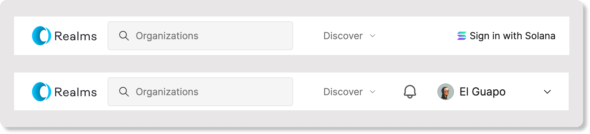

# SDK Integration


Use Cases

* Utilize addresses to gain access to rich profile information
* Check for Civic Passes - Provides verification properties of addresses such as age check, uniqueness, ID document verification, and [<mark style="color:orange;">KYC</mark>](https://www.civic.com/blog/are-you-looking-for-a-kyc-aml-solution-for-your-dapp/).


\
Use the rich profile information to personalize your user's experience:

<figure><figcaption></figcaption></figure>

### Loading the Profile Data <a href="#loading-the-profile" id="loading-the-profile"></a>

Import the [<mark style="color:orange;">SDK</mark>](https://www.npmjs.com/package/@civic/profile) and load a profile as follows:

```javascript
import { CivicProfile, Profile } from "@civic/profile";

...
// Query a user's profile using a wallet address, did or .sol domain
const profile: Profile = await CivicProfile.get(user);
```

The profile result will contain the following data:

```javascript
// The resolved public key
profile.address

// The resolved did
profile.did

// A civic.me profile name, if available
profile.name?.value

// A civic.me profile image, if available
profile.image?.url

// A civic.me profile headline, if available
profile.headline?.value

// access identifiers like connected social accounts
// [{ type: "github", value: "githubUsername" }]
profile.identifiers
```

### Getting a list of Civic Passes for the user <a href="#getting-a-list-of-civic-passes" id="getting-a-list-of-civic-passes"></a>

Returns a list of Civic passes owned by the user. This will include passes owned by the user across all  chains supported by Civic.

```
import { CivicProfile, GatewayToken } from "@civic/profile";

// Query using a wallet address, did or SNS name
const profile = await CivicProfile.get("query");

const passOptions: PassOptions = {
  includeExpired: true,
};

const passes: GatewayToken[] = await profile.getPasses(passOptions);
```
