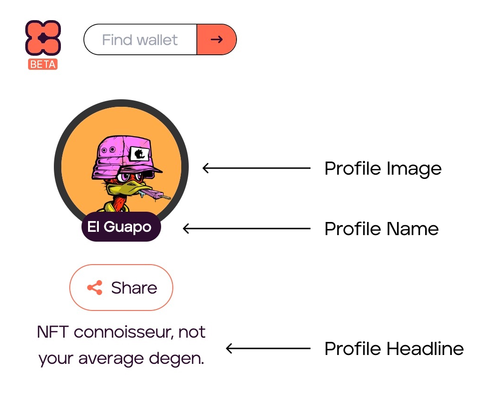
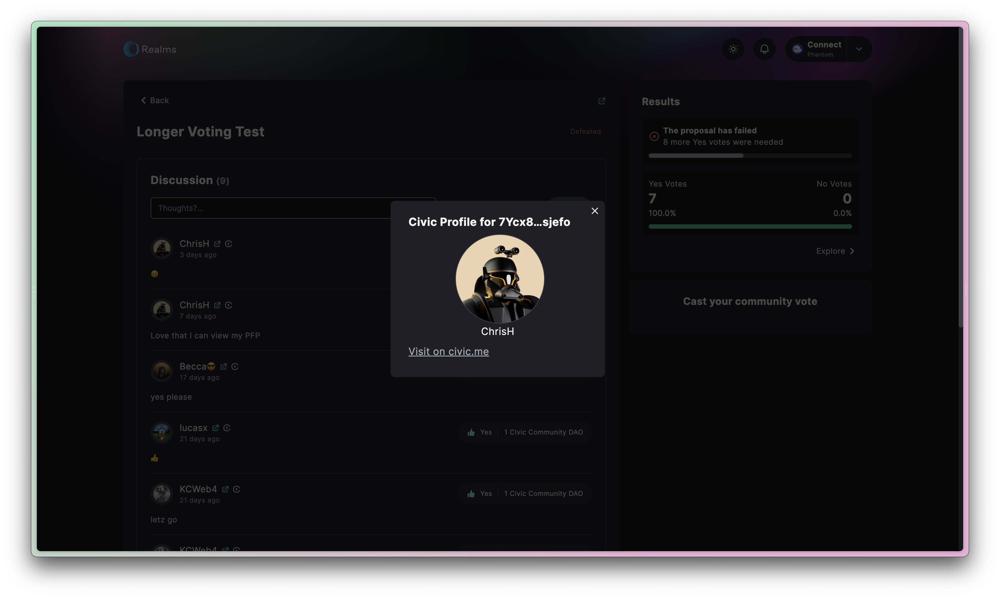

# Dynamic Web3 Profiles

A dynamic Web3 profile is a [Civic.me](http://civic.me) profile with a custom name, headline, and PFP NFT image selected by the user from the associated  .sol, did, or wallet address.&#x20;



Use this SDK for easy retrieval of the [civic.me](http://civic.me) profile data and the [Civic passes](../civic-pass/selecting-a-pass.md) associated with it.&#x20;

<div>

<figure><figcaption><p>Realms implementation of Civic's Dynamic Web3 Proflies</p></figcaption></figure>

 

<figure><figcaption></figcaption></figure>

</div>

## SDK Usage


Use Cases

* Utilize addresses to gain access to rich profile information
* Check for Civic Passes - Provides verification properties of addresses such as age check, uniqueness, ID document verification, and [KYC](https://www.civic.com/blog/are-you-looking-for-a-kyc-aml-solution-for-your-dapp/).&#x20;


### Loading the profile

Simply import the [<mark style="color:orange;">SDK</mark>](https://www.npmjs.com/package/@civic/profile) and load a profile as follows:

```javascript
import { CivicProfile, Profile } from "@civic/profile";

...
// Query a user's profile using a wallet address, did or .sol domain
const profile: Profile = await CivicProfile.get(user);
```

The corresponding profile result will contain the following data:

```javascript
// The resolved public key
profile.address

// The resolved did
profile.did

// A civic.me profile name, if available
profile.name?.value

// A civic.me profile image, if available
profile.image?.url

// A civic.me profile headline, if available
profile.headline?.value
```

### Getting a list of Civic Passes

This returns a list of Civic passes owned by the profile's keys.

```javascript
// A Solana Connection is required in order to query for passes. Public devnet used as an example here:
import { Connection, clusterApiUrl } from "@solana/web3.js";
import { CivicProfile, Profile, GatewayToken } from "@civic/profile";

const solanaConnection: Connection =  new Connection(clusterApiUrl("devnet"));
const profile: Profile = await CivicProfile.get(user, { solana: { connection }});

const passes: GatewayToken[] = await profile.getPasses();
```

By default, multiple pass types are queried. A blockchain RPC call is made for each combination of public key & pass type. The list of pass types to query can be overridden. A pass type is represented by its corresponding Gatekeeper Network address on Solana.

```javascript
const passes: GatewayToken[] = await profile.getPasses(["ni1jXzPTq1yTqo67tUmVgnp22b1qGAAZCtPmHtskqYG"]);
```

### Getting a list of associated public keys

This returns a list of Solana public keys associated with the profile.

```javascript
const profile: Profile = await CivicProfile.get(user);
const linkedKeys: PublicKey[] = await profile.getLinkedPublicKeys();
```

A queried profile returns the following data:

```javascript
        GatewayToken {
        issuingGatekeeper: PublicKey,
        gatekeeperNetwork: PublicKey,
        owner: PublicKey,
        state: 'ACTIVE',
        publicKey: PublicKey,
        programId: PublicKey,
        expiryTime: 1663038793
      }
```
