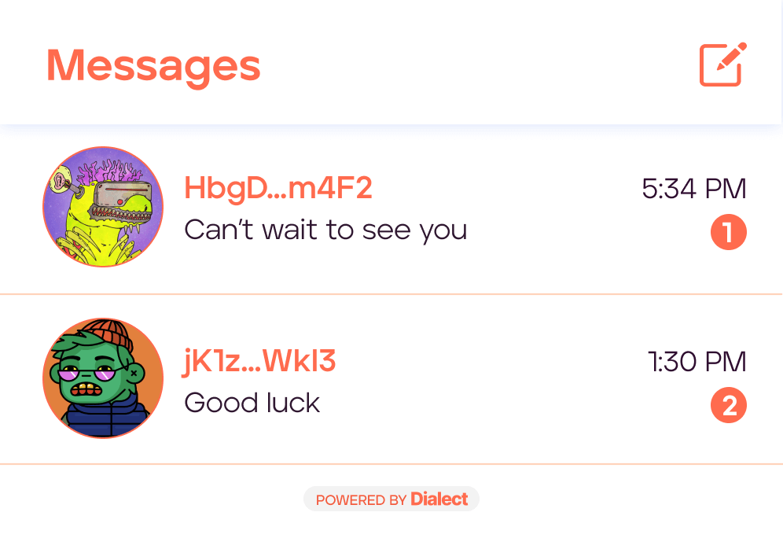

# Dialect Civic Profile Integration

To add Dialect to your dApp, follow [their guide](https://docs.dialect.to/documentation/getting-started). An easy way to get started is to adapt their reference implementation, for example: [inbox example](https://github.com/dialectlabs/react/blob/c9f6ebcd5fd51611489dc2fe5dee4a9da7d153c6/examples/inbox-multichain/pages/index.tsx).  Dialect provides an SDK with examples on how to integrate Dialect chat into your dApp.&#x20;

Additionally, Dialect provides a Civic Identity resolver to allow the Civic Dynamic Web3 profile information to be shown in Dialect's UI.

Adding Civic's Dynamic Web3 Profiles can enhance the user experience and add more personality to your messaging implementation:

&#x20;

The snippet below shows how Dialect is integrated into Civic.me&#x20;

```
export const DialectProviders: FC = ({ children }) => {
  const { wallet } = useMultiWallet();
  const { stage } = config;
  const { defaultConnection } = useConnectionList();
  const [dialectSolanaWalletAdapter, setDialectSolanaWalletAdapter] =
    useState<DialectSolanaWalletAdapter | null>(null);

  useEffect(() => {
    setDialectSolanaWalletAdapter(convertWalletForDialect(wallet));
  }, [wallet]);

  // Basic configuration for dialect. Target mainnet-beta and dialect cloud production environment
  const dialectConfig = useMemo(
    (): ConfigProps => ({
      environment: stage === Stage.prod ? "production" : "development",
      dialectCloud: {
        environment: stage === Stage.prod ? "production" : "development",
        tokenStore: "local-storage",
      },
      identity: {
        resolvers: [
          new CivicIdentityResolver(defaultConnection),
          new DialectDappsIdentityResolver(),
          new SNSIdentityResolver(defaultConnection),
          new CardinalTwitterIdentityResolver(defaultConnection),
        ],
      },
    }),
    [defaultConnection, stage]
  );

  const solanaConfig: SolanaConfigProps = useMemo(
    () => ({
      wallet: dialectSolanaWalletAdapter,
    }),
    [dialectSolanaWalletAdapter]
  );
  return (
    <DialectSolanaSdk config={dialectConfig} solanaConfig={solanaConfig}>
      <DialectThemeProvider variables={themeVariables}>
        <DialectUiManagementProvider>{children}</DialectUiManagementProvider>
      </DialectThemeProvider>
    </DialectSolanaSdk>
  );
};

```
