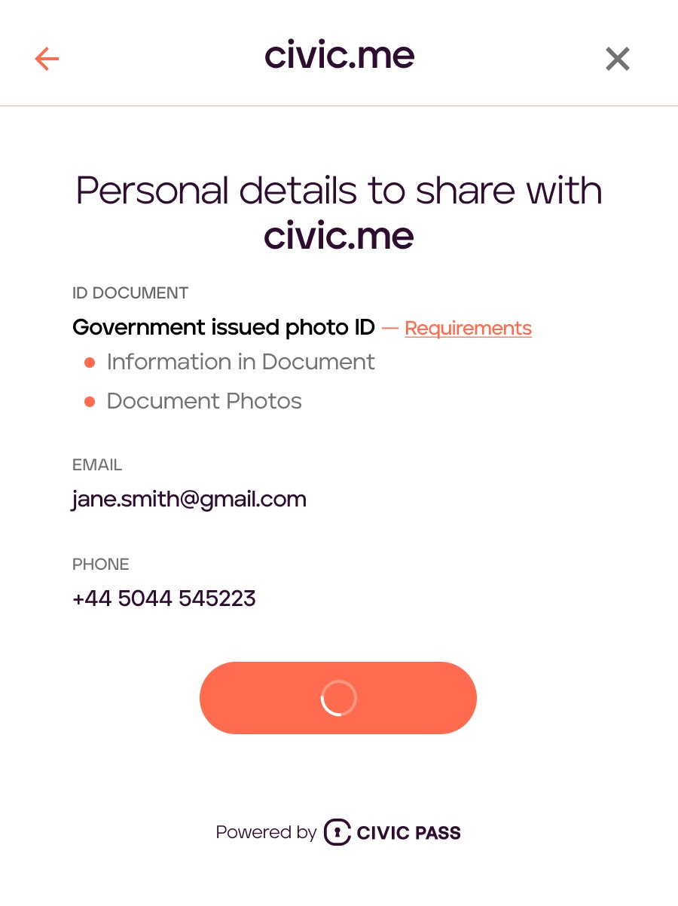

# Requesting user information

 For some use-cases, regulation requires dApps to store their user's Personal Identifiable Information (PII) for 
 auditing purposes. Civic Pass supports this use case by allowing dApps to ask the user to share their information.



## Prerequisites

 Since users agrees to share their information with a specific dApp, the feature can only enable if your dApp is using a
 [Custom Pass Verification](civic-pass/selecting-a-pass.md). To set-up your custom Civic Pass please  [Contact Us](https://share.hsforms.com/1NvBk0zfyR3aWcMosBxJETQbzn0a).

 Additionally, security best practices dictate that your app stack includes a minimal back-end that can securely authenticate and retrieve 
 the user's PII (as described below).

## Integration

### On-Chain Integration

Since PII is never stored on or shared over the blockchain, the [on-chain integration](civic-pass/on-chain-integration.md) remains identical.

### UI integration

To integrate your custom Civic Pass to your UI integration the same [GatewayProvider library](civic-pass/ui-integration-react-component/the-gateway-provider.md) 
is used. Compared to a "vanilla" integration the following additional changes apply.

#### Initialize the GatewayProvider with your Partner ID

During the set-up of your first custom Civic Pass, we will give you a partner ID that uniquely identifies you as the 
destination of the user's information. Add it to the initialization properties of the Gateway Provider:
  
```typescript
  import { GatewayProvider } from "@civic/solana-gateway-react";
  import { Connection, clusterApiUrl } from '@solana/web3.js';
  
  <GatewayProvider
    connection={new Connection(clusterApiUrl("mainnet-beta"))}
    cluster="mainnet-beta"
    wallet={wallet}
    gatekeeperNetwork={gatekeeperNetwork} 
    partnerId={partnerId}> // <-- additional property
  </GatewayProvider>
```

#### Read the presentation request ID from the Gateway context 

As with "vanilla" Civic Passes, after the user's PII has been verified by Civic (and before their Civic Pass is issued),
their Civic Pass [status](civic-pass/ui-integration-react-component/the-gateway-provider.md) changes to `IN_REVIEW`.
At that point, the property `pendingRequest` becomes available via the GatewayContext:

```typescript
const { pendingRequests } = useGateway();
```

| **pendingRequests** | An object containing an ID (`presentationRequestId`) that represents the user's information. | `PendingPayload` from `@civic/solana-gateway-react` |
|---------------------|------------------------------------------------------------------------------------------------------------------------------|-----------------------------------------------------|

Once your dApp has access to the `presentationRequestId` it has to make it available to your back-end, so that it
can then securely retrieve the user's information.

### Retrieve the user's information

#### Create JWT Token

During the set-up of your first custom Civic Pass, we will provide you with a private key. This private key is used to 
create a JWT Token that is used to authenticate against the Civic back-end. 

> :warning: Keep your private key secure **AT ALL TIMES**. Only retrieve the user's information via a secured back-end, 
> never from a browser.

You can create the JWT Token with any of the known JWT libraries, such as (jsonwebtoken)[https://www.npmjs.com/package/jsonwebtoken]. 
The following values must be set:

| Option    | Value                                                                |
|-----------|----------------------------------------------------------------------|
| algorithm | `ES256`                                                              |
| issuer    | Your partner ID                                                      |
| expiresIn | Not longer than 60s                                                  |
| audience  | `com.civic`                                                          |
| subject   | The concrete presentation request id returned by the GatewayProvider |

Here is an example code on creating such an authentication token:

```typescript
const jwt = require('jsonwebtoken');
const config = require('config');

const SIGNING_KEY_PEM = config.get('auth.privateKey');

const signingOptions = {
 algorithm: 'ES256',
 issuer: '7SXjaG9TH',
 expiresIn: '60s',
 audience: 'com.civic',
 subject: 'https://api.civic.com/sip/v3/scopeRequest/023d4e5f-ec34-44d5-84ba-7e15ae53a718'
};
const payload = {
 data: {
  "appId": "7SXjaG9TH"
 },
};
const authenticationToken = jwt.sign(payload, SIGNING_KEY_PEM, signingOptions);
```

#### Retrieve the information

To retrieve the user's information, a simple GET call for the concrete `presentationRequestId` and using JWT Token as 
the authentication header is all that is needed.

The response from Civic includes both the extracted information and pre-signed links that you can use to download the
binary images of the user's identity document.


```typescript
const axios = require('axios');

const url = `https://verify.civic.com/${presentationRequestId}`;
const Authorization = `Bearer ${authenticationHeader}`;

const response = await axios({
      url,
      method: 'get',
      headers: {
        Accept: 'application/json',
        Authorization
      },
    }).data;

const { verifiedInformation } = response;
const { } = response.links; //Alexis: Is there a way to destructure this or do we need a loop?

 "id": "abcde" // verifiaction / scope request ID
 "type": "proofOfIdentity"  // defaults to proofOfIdentity
 "status": "complete",
        "reference": "1234",   // if present
        "collection-status": <CollectionStatus>,
        "verifiedInformation": {    // Use verifiable-presentations to generate this
 "email": "m.mustermann@test.test",
         "phoneNumber": "12345",
         "name": "Max M Mustermann",
         "documentType": "passport",
         "documentNumber": "12345",
         "issueCountry": "DE"
},
 "links": [{
 "rel": "self",
 "href": "https://api.civic.com/verification/abcde"
}, {
 "rel": "evidence-document",
 "href": <s3 presigned url>
},{
 "rel": "evidence-selfie",
         "href": <s3 presigned url>
}]
}

```


#### Confirm the receipt of the user's information


