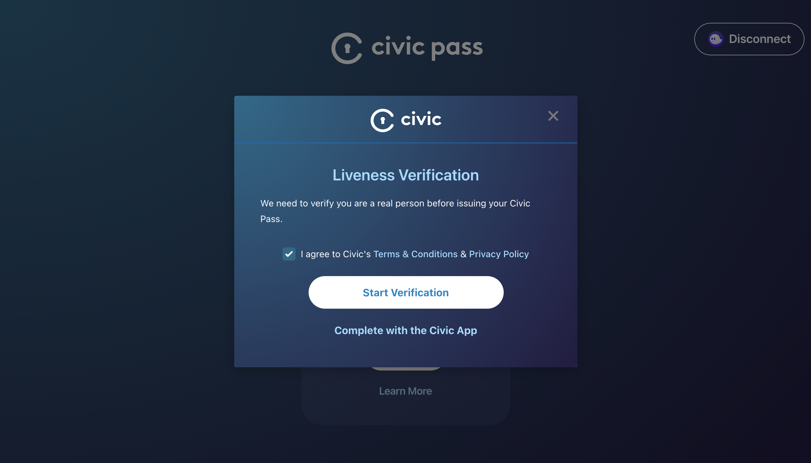

# Captcha Verification

Civic has integrated its Civic Pass Captcha Verification into Metaplex's Candy Machine to add bot protection by requiring users to complete a captcha before minting.

#### Civic Pass Captcha Verification anti-bot real person verification

To confirm the wallet holder is a real person, users will be required to complete a captcha to verify their liveness and get issued a pass.


Try out the Civic Pass Captcha Verification experience yourself by visiting the [<mark style="color:orange;">**Pass Portal ->**</mark>](https://getpass.civic.com/)\
\
**NOTE:**

Our demo portal will issue a pass on **DEVNET** and should **NOT** be used for production or to send users to get a pass prior to a mint.


A Captcha Pass remains active only for 10 minutes to limit the options of malicious botters verifying multiple wallets.&#x20;

If a user tries to use an inactive pass, it will automatically prompt them to refresh it.

