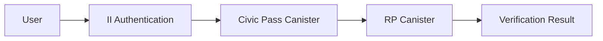

# Credential Flow and Verification Guide

### System Architecture

#### Credential Flow Between Canisters



### Demo Flow Explanation

1. User visits: https://icp-sign.civic.me/
2. Authentication via Internet Identity
3. Redirect to Civic Pass verification
4. Return to application with credential

#### Redirect Flow Details

```typescript
// Example of handling redirect in your application
window.addEventListener('message', (event) => {
  if (event.origin === 'https://icp-sign.civic.me') {
    const { credential } = event.data;
    // Process credential
  }
});
```

### Verification Implementation

#### Frontend Verification (UI/UX Only)

```typescript
import ICPCredentialCheckButton from '@civic/icp-gateway-react-ui';

const CredentialStatus = () => {
  return (
    <ICPCredentialCheckButton
      principal={principal}
      gatekeeperNetwork="captcha"
      onCredentialCheck={(response) => {
        // IMPORTANT: This is for UI feedback only
        // Do NOT use for actual verification
        updateUIStatus(response.status);
      }}
    />
  );
};
```

#### Backend Canister Verification (Required)

```typescript
import { CredentialVerifier } from '@dfinity/verifiable-credentials';

// In your canister code
export class VerificationCanister {
  private verifier: CredentialVerifier;

  async verifyCredential(credential: any, principal: Principal) {
    const result = await this.verifier.verify({
      credential,
      principalId: principal.toString(),
      canisterId: '73ncn-4qaaa-aaaag-alddq-cai'
    });

    if (!result.isValid) {
      throw new Error('Invalid credential');
    }

    // Proceed with protected operation
    return this.performProtectedOperation();
  }
}
```

#### Communication with Internet Identity

```typescript
import { AuthClient } from "@dfinity/auth-client";

async function getCredentialFromII() {
  const authClient = await AuthClient.create();
  
  const identity = await new Promise((resolve, reject) => {
    authClient.login({
      identityProvider: 'https://identity.ic0.app',
      onSuccess: () => resolve(authClient.getIdentity()),
      onError: reject
    });
  });

  return identity;
}
```

### Important Security Notes

1. **Frontend vs Backend Verification**
   * Frontend component is for UI/UX ONLY
   * All security decisions must use backend verification
   * Never trust frontend verification results
2. **DFX SDK Usage**
   * Always verify credentials on your canister
   * Implement proper error handling
   * Check credential expiration
   * Verify principal matches
3. **System Requirements**
   * Internet Identity integration
   * Civic Pass canister access
   * DFX Verifiable Credentials SDK
