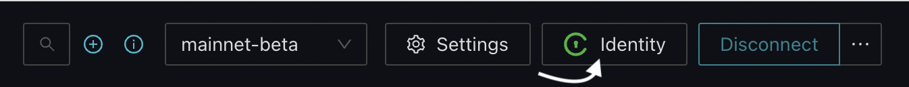
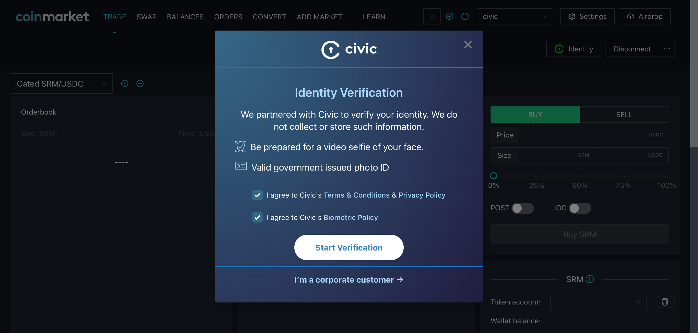

# UI integration

Civic provides a developer-friendly plug and play React Component as an easy way to request a Gateway Token from your dApp with minimal setup.&#x20;

It includes a Civic Pass status widget, the Identity Button; and an in-dApp modal to guide your users through the process:






### Basic Setup

<details>

<summary>Ethereum</summary>

**Warning:** The Ethereum front-end integration is in _alpha_ and is subject to change.

#### 1. Install the React component

Please always use `@latest`

```bash
npm i @civic/ethereum-gateway-react@latest
```

**Note:** The React component requires the use of [ethers.js](https://www.npmjs.com/package/ethers)

#### 2. Include the Gateway Context Provider ([more info](the-gateway-provider.md))

You can access the Gateway token by using the Gateway Provider that is part of the library.&#x20;

For a list of required and optional properties, please review the detailed section on the [Gateway Context Provider.](the-gateway-provider.md)


**Note:** The [useGateway hook ](the-gateway-provider.md#the-usegateway-hook)will only work in components wrapped by `<GatewayProvider>` . The Civic Pass state cannot be used outside of the `<GatewayProvider>` context. It's suggested to place the `<GatewayProvider>` as high up in the component tree as possible, to ensure the Civic Pass state is available throughout the dApp.

```jsx
import { GatewayProvider } from "@civic/ethereum-gateway-react";

<GatewayProvider
  wallet={wallet}
  gatekeeperNetwork={gatekeeperNetwork}
  >
  {children}
</GatewayProvider> 
```

#### 3. Add the Identity Button

The IdentityButton must be inside the `<GatewayProvider>` context to ensure status updates are automatically reflected by the button.

```typescript
import IdentityButton from '@civic/ethereum-gateway-react';
...
<IdentityButton />
```

### Advanced Setup

It is also possible to use a custom button and/or iframe wrapper. See the [documentation on npm](https://npmjs.com/package/@civic/ethereum-gateway-react) for more details.

</details>

<details>

<summary>Solana</summary>

#### 1. Install the React component

Please always use `@latest`

```bash
npm i @civic/solana-gateway-react@latest
```

#### 2. Include the Gateway Context Provider ([more info](the-gateway-provider.md))

You can access the Gateway token by using the Gateway Provider that is part of the library.&#x20;

For a list of required and optional properties, please review the detailed section on the [Gateway Context Provider.](the-gateway-provider.md)


**Note:** The [useGateway hook ](the-gateway-provider.md#the-usegateway-hook)will only work in components wrapped by `<GatewayProvider>` . The Civic Pass state cannot be used outside of the `<GatewayProvider>` context. It's suggested to place the `<GatewayProvider>` as high up in the component tree as possible, to ensure the Civic Pass state is available throughout the dApp.

```jsx
import { GatewayProvider } from "@civic/solana-gateway-react";

<GatewayProvider
  wallet={wallet}
  gatekeeperNetwork={gatekeeperNetwork}
  >
  {children}
</GatewayProvider> 
```

#### 3. Add the Identity Button

The IdentityButton must be inside the `<GatewayProvider>` context to ensure status updates are automatically reflected by the button.

```typescript
import IdentityButton from '@civic/solana-gateway-react';
...
<IdentityButton />
```

### Advanced Setup

It is also possible to use a custom button and/or iframe wrapper. See the [documentation on npm](https://www.npmjs.com/package/@civic/solana-gateway-react) for more details.

</details>

