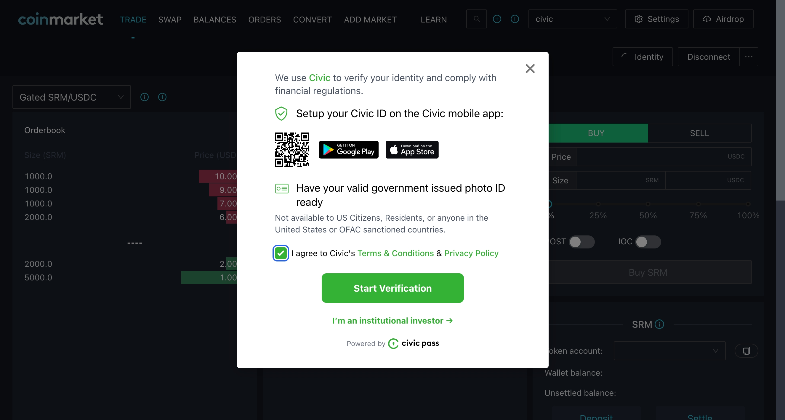
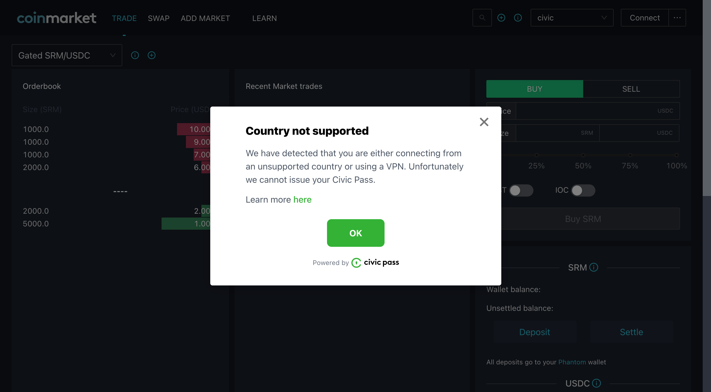

# The Gateway Provider

The **GatewayProvider** is a React component that gives children access to the GatewayContext through the **useGateway** function. This component holds the state for a given Gateway Token or Gateway Token request.

Available for [Ethereum](the-gateway-provider.md#ethereum) and [Solana](the-gateway-provider.md#solana)

## Ethereum


**Warning:** The Ethereum integration is in _alpha_ and is subject to change.



**Note:** The React component uses [ethers.js](https://www.npmjs.com/package/ethers)


```typescript
import { GatewayProvider } from "@civic/ethereum-gateway-react";

<GatewayProvider
  signer={signer}
  provider={provider}
  gatekeeperNetwork={gatekeeperNetwork}
  >
</GatewayProvider>
```

| **Property**          | Description                                                                                                              | Type                                                                   |
| --------------------- | ------------------------------------------------------------------------------------------------------------------------ | ---------------------------------------------------------------------- |
| **signer**            | An [ethers.js](https://www.npmjs.com/package/ethers) object representing the user's wallet.                              | `Signer` from `ethers`                                                 |
| **provider**          | An [ethers.js](https://www.npmjs.com/package/ethers) connection to the network. Can be undefined if not yet connected    | `Provider` from `ethers`                                               |
| **gatekeeperNetwork** | The address of the gatekeeper network. This needs to match the network within which the Civic gatekeeper issues tokens.  | `string` (see [selecting-a-pass.md](../selecting-a-pass.md "mention")) |

### The useGateway hook

The React component exposes the process status of a gateway token request, as well as the token status itself. It also provides a function to request a new gateway token. These can be accessed through the `useGateway` hook:

```typescript
import { useGateway } from "@civic/ethereum-gateway-react";
```

#### Requesting a gateway token

A function is provided to initiate a request for a new gateway token:

```typescript
const { requestGatewayToken } = useGateway()
```

This could be triggered by a button, for example:

```jsx
<button onclick={requestGatewayToken}>Validate your wallet</button>
```

Calling this function should open an iframe connected to the Civic Gatekeeper, which will guide the user through a flow to verify their identity and other prerequisites:



#### Reading the gateway state

Besides the `refreshGatewayToken` function, the `useGateway` hook also exposes some state variables to indicate the status of the Civic Pass request flows and the state of the token itself.

```typescript
const { gatewayStatus, gatewayToken } = useGateway();
```

| **gatewayStatus** | Indicates the overall status of the Civic Pass. This should ideally displayed to the user. Some states are linked to an on-chain gateway token, while others indicate progress or error conditions during which a gateway token might not exist.                                                                                                                                                                                                                                         | `GatewayStatus` from `@civic/ethereum-gateway-react` |
| ----------------- | ---------------------------------------------------------------------------------------------------------------------------------------------------------------------------------------------------------------------------------------------------------------------------------------------------------------------------------------------------------------------------------------------------------------------------------------------------------------------------------------- | ---------------------------------------------------- |
| **gatewayToken**  | <p>Represents the on-chain Ethereum structure for the gateway token. This will only be defined if the on-chain token is ACTIVE and dApp usage should be allowed.</p><p>If the token does not exist or is in a non-active state (e.g. Frozen), this state variable will be <code>undefined</code> . The dApp could disable certain parts of the UI when gatewayToken is undefined to prevent dApp usage.</p><p>This complements the on-chain Rust check, but should not replace it.  </p> | `GatewayToken` from `@identity.com/gateway-eth-ts`   |

## Solana


```typescript
import { GatewayProvider } from "@civic/solana-gateway-react";

const clusterUrl = // Solana RPC endpoint;

<GatewayProvider
  wallet={wallet}
  gatekeeperNetwork={gatekeeperNetwork}
  clusterUrl={clusterUrl}
  >
</GatewayProvider>
```

| **Property**                | Description                                                                                                                                                                                                                   | Type                                                                                                                                                  |
| --------------------------- | ----------------------------------------------------------------------------------------------------------------------------------------------------------------------------------------------------------------------------- | ----------------------------------------------------------------------------------------------------------------------------------------------------- |
| **wallet**                  | An object representing the user's wallet. This may be `undefined` if a wallet hasn't been connected to the dApp yet.                                                                                                          | <p><code>{</code></p><p>  <code>publicKey,  signTransaction</code> </p><p><code>}</code> (see definitions below)</p>                                  |
| **wallet.publicKey**        | The user wallet's public key                                                                                                                                                                                                  | `PublicKey` from `@solana/web3.js`                                                                                                                    |
|  **wallet.signTransaction** | A function that asks the user's wallet to sign a transaction.                                                                                                                                                                 | <p><code>(transaction: Transaction) => Promise&#x3C;Transaction></code></p><p>where <code>Transaction</code> is from <code>@solana/web3.js</code></p> |
| **gatekeeperNetwork**       | The public key of the gatekeeper network. This needs to match the network within which the Civic gatekeeper issues tokens.                                                                                                    | `PublicKey` from `@solana/web3.js`                                                                                                                    |
| **clusterUrl**              | The React Component requires you to pass in a Solana RPC endpoint.                                                                                                                                                            | `string`                                                                                                                                              |
| **cluster**                 | If the RPC endpoint passed as clusterUrl is not pointing to mainnet-beta, you must specify the cluster. Supported are "devnet" and "testnet". This is so that Civic's servers generate a transaction for the correct cluster. | `string`                                                                                                                                              |
| **gatekeeperSendsTransaction**                 | The gatekeeper will send the transaction to the blockchain. Defaults to `false`.  When `false`, the user will be prompted to sign and send the transaction. This is handled internally by the React Component. To customize this behavior the `handleTransaction` callback function needs to be provided | `string`                                                                                                                                              |
| **handleTransaction**                 | An optional callback function that will invoked with a partially signed transaction for the user to sign and send to the blockchain when the property gatekeeperSendsTransaction is false. | `(transaction: Transaction) => Promise<void>`                                                                                                                                              |

### The useGateway hook

The React component exposes the process status of a gateway token request, as well as the token status itself. It also provides a function to request a new gateway token. These can be accessed through the `useGateway` hook:

```typescript
import { useGateway } from "@civic/solana-gateway-react";
```

#### Requesting a gateway token

A function is provided to initiate a request for a new gateway token:

```typescript
const { requestGatewayToken } = useGateway()
```

This could be triggered by a button, for example:

```jsx
<button onclick={requestGatewayToken}>Validate your wallet</button>
```

Calling this function should open an iframe connected to the Civic Gatekeeper, which will guide the user through a flow to verify their identity and other prerequisites:


#### Reading the gateway state

Besides the `refreshGatewayToken` function, the `useGateway` hook also exposes some state variables to indicate the status of the Civic Pass request flows and the state of the token itself.

```typescript
const { gatewayStatus, gatewayToken } = useGateway();
```

| **gatewayStatus** | Indicates the overall status of the Civic Pass. This should ideally displayed to the user. Some states are linked to an on-chain gateway token, while others indicate progress or error conditions during which a gateway token might not exist.                                                                                                                                                                                                                                       | `GatewayStatus` from `@civic/solana-gateway-react`    |
| ----------------- | -------------------------------------------------------------------------------------------------------------------------------------------------------------------------------------------------------------------------------------------------------------------------------------------------------------------------------------------------------------------------------------------------------------------------------------------------------------------------------------- | ----------------------------------------------------- |
| **gatewayToken**  | <p>Represents the on-chain Solana structure for the gateway token. This will only be defined if the on-chain token is ACTIVE and dApp usage should be allowed.</p><p>If the token does not exist or is in a non-active state (e.g. Frozen), this state variable will be <code>undefined</code> . The dApp could disable certain parts of the UI when gatewayToken is undefined to prevent dApp usage.</p><p>This complements the on-chain Rust check, but should not replace it.  </p> | `GatewayToken` from `@identity.com/solana-gateway-ts` |


## The Gateway Status

The following is a list of all the possible states of the Civic Pass

**Statuses where a Civic Pass exists**

| **Status** | Description                                                                                      | Behaviour when triggered                                                          |
| ---------- | ------------------------------------------------------------------------------------------------ | --------------------------------------------------------------------------------- |
| `ACTIVE`   | The Civic Pass is Active. The user can trade.                                                    | Opens the Civic Pass modal dialog with a user-friendly explanation of the status. |
| `EXPIRED`  | The Civic Pass has expired An IP check and proof of wallet ownership are required to refresh it. | Proof of wallet ownership is automatically initiated                              |
| `FROZEN`   | The Pass has been frozen, for example because the user connected from a blocked IP               | Opens the Civic Pass modal dialog with a user-friendly explanation of the status. |
| `REVOKED`  | The Pass has been revoked, for example because the user connected from a banned IP               | Opens the Civic Pass modal dialog with a user-friendly explanation of the status. |

**Status where a Civic Pass may not exist yet**

| **Status**                     | Description                                                                                                                                                                                                                                                                                                      | Behaviour when triggered                                                                                        |
| ------------------------------ | ---------------------------------------------------------------------------------------------------------------------------------------------------------------------------------------------------------------------------------------------------------------------------------------------------------------- | --------------------------------------------------------------------------------------------------------------- |
| `UNKNOWN`                      | No user wallet is connected or no gatekeeper network set                                                                                                                                                                                                                                                         | _None_                                                                                                          |
| `CHECKING`                     | Checking whether a Pass exists for the connected wallet.                                                                                                                                                                                                                                                         | _None_                                                                                                          |
| `NOT_REQUESTED`                | The wallet is connected but no Pass has been requested yet.                                                                                                                                                                                                                                                      | Opens the Civic Pass modal dialog and initiates the token request flow                                          |
| `COLLECTING_USER_INFORMATION`  | The required user information is being collected. Depending on the  Network configured, this ranges from a simple CAPTCHA to full KYC.                                                                                                                                                                           | Opens the Civic Pass modal dialog and resumes the collection of the required information.                       |
| `VALIDATING_USER_INFORMATION`  | <p>The user's identity information has been collected successfully and is being verified.<br></p><p><em>This status is only available when KYC is in progress and only when the user has chosen to do KYC via on his browser. I.e. not relevant for the Ignite Pass that is used  with CandyMachine v2.</em></p> | Opens the Civic Pass modal dialog with a user-friendly explanation of the status.                               |
| `USER_INFORMATION_VALIDATED`   | <p>The user's identity has been validated.<br><br><em>This status is only available when KYC is in progress and only when the user has chosen to do KYC via on his browser. I.e. not relevant for the Ignite Pass that is used  with CandyMachine v2.</em></p>                                                   | Opens the Civic Pass modal dialog and asks the user to re-authenticate so that the request process can proceed. |
| `USER_INFORMATION_REJECTED`    | <p>The user's identity verification request has been rejected.<br><br><em>This status is only available when KYC is in progress and only when the user has chosen to do KYC via on his browser. I.e. not relevant for the Ignite Pass that is used with CandyMachine v2.</em></p>                                | Opens the Civic Pass modal displaying the reasons for the rejection ( for example blurry document scan).        |
| `CONFIRM_WALLET_TRANSACTION`   | The user needs to confirm wallet ownership on their wallet                                                                                                                                                                                                                                                       | Opens the Civic Pass modal dialog with a user-friendly explanation of the status.                               |
| `IN_REVIEW`                    | The Civic Pass has been requested and the Gatekeeper is reviewing the request                                                                                                                                                                                                                                    | Opens the Civic Pass modal dialog with a user-friendly explanation of the status.                               |

#### Status when the user is going through identity verification on his browser


**Error statuses**

| **Status**               | Description                                            | Behaviour when triggered                                                          |
| ------------------------ | ------------------------------------------------------ | --------------------------------------------------------------------------------- |
| `LOCATION_NOT_SUPPORTED` | The user's location is not currently supported         | Opens the Civic Pass modal dialog with a user-friendly explanation of the status. |
| `ERROR`                  | There was an unexpected error requesting a Civic Pass. | Opens the Civic Pass modal dialog and the user can restart the process.           |
| `REJECTED`               | The token requests has been rejected by the Gatekeeper | Opens the Civic Pass modal dialog with a user-friendly explanation of the status. |


