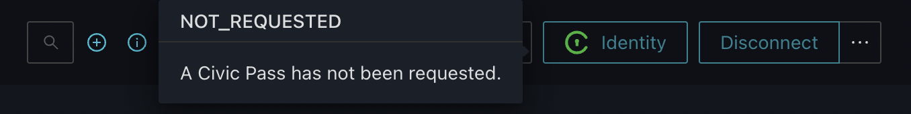

# The Identity Button

The **IdentityButton** is a reference implementation of a UI component to communicate to dApp users the current status of their Gateway Token, or Gateway Token request.&#x20;

It changes appearance with text and icons to indicate when the user needs to take action and can be clicked by the user at any point in the process. The initial click on the button by a user will initiate the flow for the user to create a new Gateway Token: if a token already exists for the user, the UI will already have updated to show the 'Active' status.

Once the user has gone through KYC and submitted their Gateway Token request via the Civic compliance iFrame, any subsequent click will launch the Civic compliance iframe with a screen describing the current status of the flow.

| Property      | Description                                                                     | Type          |
| ------------- | ------------------------------------------------------------------------------- | ------------- |
| **mode**      | The default setting of the button is dark. We also provide a `light mode`.      | DARK \| LIGHT |
| **animation** | The button provides a neat animation on hover. The default value is `dark mode` | true \| false |

<details>

<summary>Ethereum</summary>

```javascript
import {
  IdentityButton,
  ButtonMode,
} from '@civic/ethereum-gateway-react';

<IdentityButton mode={ButtonMode.LIGHT} animation={true} />
```

</details>

<details>

<summary>Solana</summary>

```javascript
import {
  IdentityButton,
  ButtonMode,
} from '@civic/solana-gateway-react';

<IdentityButton mode={ButtonMode.LIGHT} animation={true} />
```

</details>

Here's an example of the status information the user will see when they mouse over the Identity Button:



