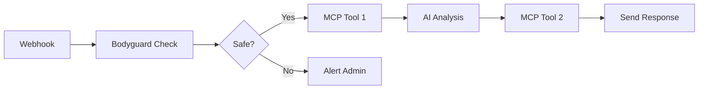

## Overview

Integrate Civic Labs MCP tools into your n8n workflows to create powerful AI-driven automations. Our pre-built nodes and templates make it easy to combine LLMs with external tools.

## Installation

### 1. Install the Civic Labs n8n Node

```bash
# In your n8n installation directory
npm install @civic/n8n-nodes-civic-labs
```

### 2. Configure Credentials

In n8n, go to **Credentials** and add:

1. **Civic Labs API**: Your API key from [civic-labs.com/dashboard](https://civic-labs.com/dashboard)
2. **LLM Provider**: Your preferred AI model credentials (OpenAI, Anthropic, AWS Bedrock)

## Quick Start Templates

### Template 1: AI-Powered GitHub Issue Triage

Import this workflow to automatically triage GitHub issues using AI:

```json
{
  "name": "AI GitHub Issue Triage",
  "nodes": [
    {
      "name": "GitHub Webhook",
      "type": "n8n-nodes-base.webhook",
      "parameters": {
        "path": "github-issues",
        "responseMode": "onReceived"
      }
    },
    {
      "name": "Civic Labs MCP",
      "type": "@civic/n8n-nodes-civic-labs.mcpHub",
      "parameters": {
        "tool": "bodyguard",
        "prompt": "={{$json.issue.body}}"
      }
    },
    {
      "name": "AI Analysis",
      "type": "@civic/n8n-nodes-civic-labs.mcpHub",
      "parameters": {
        "tool": "github-analyze",
        "issueUrl": "={{$json.issue.url}}"
      }
    }
  ]
}
```

[Download Full Template](https://hub.civic-labs.com/templates/github-triage.json)

### Template 2: Customer Support Automation

Automate support ticket responses with security checks:

```json
{
  "name": "Secure Support Bot",
  "nodes": [
    {
      "name": "Support Ticket",
      "type": "n8n-nodes-base.trigger"
    },
    {
      "name": "Security Check",
      "type": "@civic/n8n-nodes-civic-labs.bodyguard",
      "parameters": {
        "prompt": "={{$json.message}}",
        "threshold": 0.7
      }
    },
    {
      "name": "Generate Response",
      "type": "@civic/n8n-nodes-civic-labs.mcpHub",
      "parameters": {
        "tool": "knowledge-base-search",
        "query": "={{$json.message}}"
      }
    }
  ]
}
```

## Available Nodes

### Civic Labs MCP Hub Node

Access any MCP tool through a single node:

**Parameters:**
- `tool`: Select from available MCP tools
- `parameters`: Tool-specific parameters
- `timeout`: Execution timeout (ms)
- `retry`: Number of retry attempts

**Example:**
```javascript
{
  "tool": "github-search",
  "parameters": {
    "query": "bug in:title",
    "repo": "civic-labs/docs"
  }
}
```

### Bodyguard Security Node

Analyze prompts for security threats:

**Parameters:**
- `prompt`: Text to analyze
- `threshold`: Threat score threshold (0-1)
- `action`: What to do if threat detected (block/flag/continue)

### Guardrail Policy Node

Apply security policies to tool calls:

**Parameters:**
- `policies`: Array of policy names to apply
- `parameters`: The parameters to validate
- `strict`: Fail if any policy fails (boolean)

## Advanced Workflows

### Multi-Step AI Pipeline



### Parallel Tool Execution

Use n8n's Split In Batches node to execute multiple MCP tools in parallel:

```javascript
// In Function node before MCP Hub
const tools = ['github-search', 'jira-search', 'docs-search'];
return tools.map(tool => ({
  json: {
    tool,
    query: items[0].json.query
  }
}));
```

### Error Handling

Implement robust error handling:

```javascript
// Error Handler Function node
if ($input.error) {
  const error = $input.error;
  
  if (error.code === 'RATE_LIMIT') {
    // Wait and retry
    return { 
      json: { 
        retry: true, 
        delay: error.retryAfter 
      } 
    };
  }
  
  if (error.code === 'AUTH_REQUIRED') {
    // Trigger reauth flow
    return { 
      json: { 
        requiresAuth: true, 
        service: error.service 
      } 
    };
  }
  
  // Log other errors
  return { 
    json: { 
      error: error.message,
      alert: true 
    } 
  };
}
```

## Best Practices

### 1. Security First
Always use Bodyguard to check user inputs before processing:

```
User Input → Bodyguard → Decision → MCP Tools
```

### 2. Rate Limit Handling
Implement exponential backoff:

```javascript
const backoff = Math.min(1000 * Math.pow(2, retryCount), 30000);
```

### 3. Credential Management
- Use n8n's credential system for all secrets
- Never hardcode API keys in workflows
- Rotate credentials regularly

### 4. Monitoring
Add logging nodes to track:
- Tool execution times
- Error rates
- Security threat detections

## OAuth Tool Integration

For tools requiring OAuth (GitHub, Jira, etc.):

1. **Initial Setup**: The first use triggers OAuth flow
2. **Token Storage**: n8n securely stores tokens
3. **Auto Refresh**: Tokens refresh automatically
4. **Revocation**: Manage in Civic Labs dashboard

## Performance Tips

### Caching
Enable caching for frequently accessed data:

```javascript
{
  "tool": "knowledge-search",
  "parameters": {
    "query": "{{$json.query}}",
    "cache": true,
    "cacheTTL": 3600
  }
}
```

### Batch Processing
Process multiple items efficiently:

```javascript
// Batch multiple GitHub issues
const batchSize = 10;
const batches = [];
for (let i = 0; i < items.length; i += batchSize) {
  batches.push(items.slice(i, i + batchSize));
}
```

### Async Execution
Use n8n's async features for long-running tools:

```javascript
{
  "tool": "code-analysis",
  "parameters": {
    "repo": "{{$json.repo}}",
    "async": true,
    "webhookUrl": "{{$node.Webhook.webhookUrl}}"
  }
}
```

## Debugging Workflows

### Enable Debug Mode

In your Civic Labs node:
```javascript
{
  "debug": true,
  "logLevel": "verbose"
}
```

### Use n8n's Execution Data

Access detailed execution logs:
- Click on any node
- View "Input" and "Output" tabs
- Check error details in red nodes

### Test with Mock Data

Create test workflows with Function nodes:
```javascript
return [{
  json: {
    test: true,
    prompt: "Test security check",
    expectedScore: 0.1
  }
}];
```

## Example Use Cases

### 1. Automated Code Review
- Trigger: GitHub PR webhook
- Security check with Bodyguard
- Code analysis with MCP tools
- Post review comments

### 2. Smart Documentation Search
- Trigger: Slack command
- Search across multiple sources
- AI-powered result ranking
- Format and send response

### 3. Infrastructure Monitoring
- Trigger: Scheduled (cron)
- Query multiple monitoring tools
- AI analysis of metrics
- Alert on anomalies

## Troubleshooting

**"MCP tool not found"**
- Verify tool name in Civic Labs dashboard
- Check API key permissions
- Ensure tool is enabled for your account

**"OAuth flow failed"**
- Clear n8n credential cache
- Re-authenticate in Civic Labs dashboard
- Check redirect URI configuration

**"Timeout errors"**
- Increase timeout in node settings
- Check if tool supports async execution
- Consider breaking into smaller operations

## Support Resources

- [n8n Community Forum](https://community.n8n.io)
- [Civic Labs Discord](https://discord.gg/civic-labs)
- [Workflow Templates](https://hub.civic-labs.com/templates)
- [Video Tutorials](https://youtube.com/civic-labs)

## Next Steps

- [API Reference](/labs/integration/api-reference) - Detailed API docs
- [Vercel AI Integration](/labs/integration/vercel-ai) - Build AI apps
- [SDK Reference](/labs/dev/sdk-reference) - Custom integrations