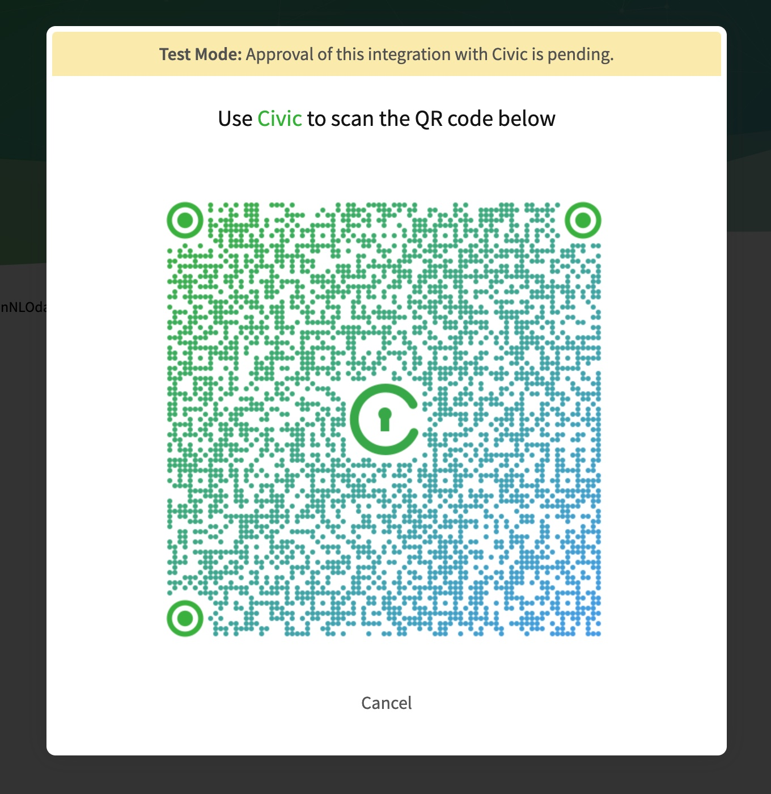
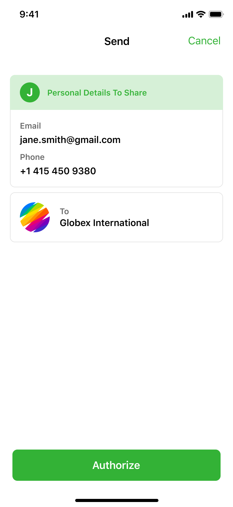

# Step-by-step guide

### Step 0: Initialize Civic client library&#x20;

First of all, you must include the Civic front-end library on your front-end. This exposes a single global object, civic.

```
<link rel="stylesheet" href="https://hosted-sip.civic.com/css/civic-modal.min.css">

<script src="https://hosted-sip.civic.com/js/civic.sip.min.js"></script>

```

Then, initialize it by passing in your application ID (for example ‘foo123’). You can find your application ID in the Application details section of your Civic Integration Portal Applications section.

```
// Instantiate instance of civic.sip
  var civicSip = new civic.sip({
    appId: 'ABC123',
    // OPTIONAL configuration
    hideIntro: false, // set to true to override intro screen (Proof of Identity only)
  });
```

Additionally a button to initiate the verification process should be added to your web page. For example, for a signup scenario, place a “Continue with Civic” button on your page (see our [style guidelines](https://www.civic.com/resources/brand-guidelines/) for the Civic color palette and related iconography):

It is also recommended to give user’s context on the process they will need to go through. For example, if you need to verify their identity, let them know that they need to download the Civic App and have a government issued ID ready as well as be in a well lit location so that the Images they take are clear and legible.

```
<button id="signupButton" class="civic-button-a medium" type="button">
    <span>Continue with Civic</span>
</button>
```

### Step 1: Request user data <a href="#step-1-request-user-data" id="step-1-request-user-data"></a>

To request data about your user, you must initialise a new scope-request from your front-end. Scope requests are objects that detail specific sets of verified data you wish returned from your user.

Create a new scope-request by calling the `signup` method of the `civic` global object, passing in the type of scope-request to resolve.

In our example, we will use the `BASIC_SIGNUP` type, which requests your user’s verified email address. You can find details on all supported scope request types here.

```
 var button = document.querySelector('#signupButton');
 button.addEventListener('click', function () {
        civicSip.signup({ style: 'popup', 
        scopeRequest: civicSip.ScopeRequests.BASIC_SIGNUP });
  });
```

When calling the `signup` method, the Civic front-end library opens a modal dialog displaying a Civic Wallet QR code or a button to open the Civic App if viewed on a mobile browser. This QR code/app link is generated specifically for this scope-request and can only be used once.

 

The QR code/app link bridges the air gap between the browser and the user’s smartphone. The user scans the QR code using the Civic Wallet app and is prompted to authorize or deny the scope request. The prompt highlights the data that is being requested and the requesting party.

#### MOBILE BROWSER NOTE <a href="#mobile-browser-note" id="mobile-browser-note"></a>

When using the Civic SIP flow from a mobile browser, we do not show the QR Code, but instead direct the user from the browser to the Civic App using deeplinking.

Once the user approves the scope request on the Civic App, they will be redirected back to the browser with a new tab being opened on your integrated web page. We append a query parameter called uuid to the parent URL so that we can identify the fact that this page is loading after returning from the Civic App.

### Step 2: Receive JWT Token <a href="#step-2-receive-jwt-token" id="step-2-receive-jwt-token"></a>

In order to retrieve the encrypted user data, you first need the request-specific JWT Token that is generated as soon as the user authorizes the scope-request. We call this JWT token `auth-code`.

Your front-end has access to this token by registering an event handler for the 'auth-code-received' event. The token is available under the 'response' property:

```
civicSip.on('auth-code-received', function (event) {
    /*event:
        {
            response: "The JWT Token in base64"
        }*/
  });
```

You can find details on all events emitted by the Civic front-end library.

### Step 3: Forward the token to your back-end <a href="#step-3-forward-the-token-to-your-back-end" id="step-3-forward-the-token-to-your-back-end"></a>

Now that you have the auth-token in your front-end, you must forward it to your back-end, so that it can be securely exchanged for the PII using the Civic back-end SDK. How you achieve this is up to you, but assuming you have a method `sendAuthCodetoBackEnd` your event handler code will probably look very similar to this:

```
  civicSip.on('auth-code-received', function (event) {
    // encoded JWT Token is sent to the server
    var jwtToken = event.response;

    // Your function to pass JWT token to your server
    sendAuthCodeToBackEnd(jwtToken);
  });
```

### Step 4: Exchange token for user data <a href="#step-4-exchange-token-for-user-data" id="step-4-exchange-token-for-user-data"></a>

First, create an instance of the Civic Server SDK, passing in your application ID, private signing key and secret.

**Your private keys and secret should only be used on the server and never exposed on the client side.**

If you are using a Node.js back-end, then you simply `npm install civic-sip-api` and initialize the civic-sip-api npm package into your Node.js application with your account details:

```
const civicSDK = require('civic-sip-api');

// Step 4: Initialize the instance passing your appId and secret.
const civicClient = civicSDK.newClient({
  appId: 'foo123',
  prvKey: PRIVATE_KEY,
  appSecret: APP_SECRET,
});
```

Once you have received the request-specific JWT token from your front-end, you can exchange it for the user data you requested.

> User data is returned to your server encrypted with your secret and signed by Civic. The Civic server SDK verifies and decrypts it transparently. Also, for security reasons a JWT token can only be used once for user data exchange. If the token is exchanged and user data needs to be fetched again, a new request must be approved by the user.

```
civicClient.exchangeCode(jwtToken)
    .then((userData) => {
        // store and use the user data as appropriate to your system
        /* {
             "data": [
               {
                "label": "contact.personal.email",
                "value": "jonsmith@example.com"
               }
             ]
          } */ 

    }).catch((error) => {
        console.log(error);
    });
```
