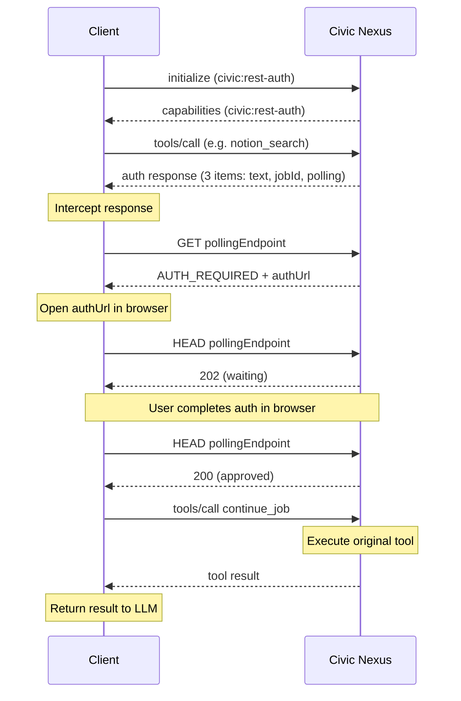

This document describes how an MCP client can implement the `civic:rest-auth` capability to intercept auth-required responses, handle user authentication out-of-band, and automatically resume the tool call — all before the auth message ever reaches the LLM.

## Overview

Without `civic:rest-auth`, auth-required responses are returned directly to the LLM as text content. The LLM sees the authorization URL, renders it for the user, and waits for the user to manually tell it to continue. This works but is clunky.

With `civic:rest-auth`, the client can:

1. Declare the capability during MCP initialization
2. Intercept auth-required tool responses before they reach the LLM
3. Retrieve the authorization URL from the polling endpoint
4. Open the authorization URL for the user (browser redirect, popup, etc.)
5. Poll for completion
6. Automatically call `continue_job` to resume the original tool call
7. Return the final result to the LLM as if auth was never needed

If polling times out, the client falls back to passing the auth message to the LLM with the clickable browser link (obtained from the polling endpoint) and an instruction to retry the action after the user completes authorization.

## Step 1: Declare the capability

During MCP initialization, include `civic:rest-auth` in your client's experimental capabilities:

```json
{
  "method": "initialize",
  "params": {
    "clientInfo": { "name": "my-client", "version": "1.0.0" },
    "capabilities": {
      "experimental": {
        "civic:rest-auth": { "version": "1.0" }
      }
    }
  }
}
```

Civic Nexus advertises the same capability in its server capabilities. When both sides declare it, Civic Nexus switches to the `rest-auth` strategy for this session.

## Step 2: Detect the auth-required response

When `civic:rest-auth` is active, the auth-required tool response contains **3 content items** — a text message, a `continue_job_id`, and an `auth_polling_endpoint`. Notably, it does **not** include the `authorization_url` — the client retrieves that from the polling endpoint instead.

```json
{
  "content": [
    {
      "type": "text",
      "text": "Authorization required."
    },
    {
      "type": "resource",
      "resource": {
        "uri": "https://nexus.civic.com/jobs/job-uuid-here",
        "mimeType": "text/plain",
        "text": "job-uuid-here",
        "_meta": { "name": "continue_job_id" }
      }
    },
    {
      "type": "resource",
      "resource": {
        "uri": "https://nexus.civic.com/user/jobs/550e8400-.../status",
        "mimeType": "text/plain",
        "text": "https://nexus.civic.com/user/jobs/550e8400-.../status",
        "_meta": { "name": "auth_polling_endpoint" }
      }
    }
  ]
}
```

The presence of `auth_polling_endpoint` (and absence of `authorization_url`) signals that the client should handle auth programmatically.

### Detection and parsing

```typescript
interface CivicAuthInfo {
  continueJobId: string;
  pollingEndpoint: string;
}

function parseCivicAuthResponse(result: CallToolResult): CivicAuthInfo | null {
  const jobResource = result.content?.find(
    (c) => c.type === "resource" && c.resource?._meta?.name === "continue_job_id",
  );
  const pollingResource = result.content?.find(
    (c) => c.type === "resource" && c.resource?._meta?.name === "auth_polling_endpoint",
  );

  if (!jobResource || !pollingResource) return null;

  return {
    continueJobId: jobResource.resource.text,
    pollingEndpoint: pollingResource.resource.text,
  };
}
```

<Note>
**SDK integrations:** When integrating with AI SDKs (e.g. Vercel AI SDK's `ToolSet`), the tool execute return type may be `unknown` rather than a typed `CallToolResult`. In that case, add defensive checks before accessing nested properties — guard against `null`, verify `typeof` for each level, and check that `content` is an array before calling `.find()`.
</Note>

## Step 3: Get the auth URL and redirect the user

Once you detect an auth-required response, intercept it before it reaches the LLM.

Make an initial `GET` request to the polling endpoint to retrieve the authorization URL:

```typescript
const response = await fetch(authInfo.pollingEndpoint, {
  headers: authHeaders,
});
const data = await response.json();
// data = { jobId: "...", status: "AUTH_REQUIRED", authUrl: "https://..." }
const authUrl = data.authUrl;
```

Then open the `authUrl` for the user (popup, redirect, embedded webview — whatever fits your client).

<Info>
**Already authorized?** If the user has previously authorized (e.g. from a prior session), the job may already be `APPROVED` by the time your first GET returns. Check `data.status` — if it's already `APPROVED`, skip straight to step 5 (`continue_job`). There is no need to open a browser or poll.
</Info>

## Step 4: Poll for completion

### Polling endpoint

`GET /user/jobs/:id/status` returns the job status without ever exposing the token:

| Status | HTTP code | Response body |
|---|---|---|
| `PENDING` | 202 | `{ "jobId": "...", "status": "PENDING" }` |
| `AUTH_REQUIRED` | 202 | `{ "jobId": "...", "status": "AUTH_REQUIRED", "authUrl": "..." }` |
| `APPROVED` | 200 | `{ "jobId": "...", "status": "APPROVED" }` |
| `ERROR` | 422 | `{ "jobId": "...", "status": "ERROR", "error": "..." }` |

A `HEAD` request to the same endpoint returns only status codes (no body), useful for bandwidth-efficient polling after you already have the `authUrl`. The status codes mirror the GET response (`200` = approved, `202` = pending/auth-required, `422` = error).

<Info>
The polling endpoint requires the same JWT or API key used for MCP calls. Pass it as a `Bearer` token in the `Authorization` header.
</Info>

### Polling implementation

```typescript
const POLL_INTERVAL_MS = 2000;
const POLL_TIMEOUT_MS = 15_000; // 15 seconds — transparent interception window

async function pollForApproval(
  pollingEndpoint: string,
  authHeaders: Record<string, string>,
  signal: AbortSignal,
): Promise<boolean> {
  const deadline = Date.now() + POLL_TIMEOUT_MS;

  // Wait one interval before the first check so the client has time
  // to present the auth URL to the user
  await new Promise((r) => setTimeout(r, POLL_INTERVAL_MS));

  while (Date.now() < deadline && !signal.aborted) {
    const response = await fetch(pollingEndpoint, {
      method: "HEAD",
      headers: authHeaders,
      signal,
    });

    // 200 = APPROVED — auth completed successfully
    if (response.status === 200) return true;

    // 202 = still waiting (PENDING or AUTH_REQUIRED), keep polling
    if (response.status === 202) {
      await new Promise((r) => setTimeout(r, POLL_INTERVAL_MS));
      continue;
    }

    // 422 = ERROR (auth failed), 404/403 = access issue — stop polling
    return false;
  }

  return false; // Timed out
}
```

<Info>
**Timeout guidance:** The timeout controls how long the client silently intercepts auth before falling back to the LLM. A shorter value (e.g. 15s) keeps the UX responsive — if auth doesn't complete quickly, the user sees the link in the chat and can act on it manually. A longer value (e.g. 120s) is appropriate when the client has its own UI for showing auth progress (loading spinner, status bar). Choose based on how visible the auth flow is to the user in your client.
</Info>

## Step 5: Resume or fall back

When polling succeeds (status is `APPROVED`), call `continue_job` to resume the original tool call:

```typescript
const result = await mcpClient.callTool({
  name: "continue_job",
  arguments: { jobId: authInfo.continueJobId },
});
```

The `continue_job` response is the output of the original tool call — return it to the LLM as if auth was never needed.

**Important:** The `continue_job` result may itself be another auth-required response (for multi-step auth flows). Check it with `parseCivicAuthResponse` again and repeat steps 3–5 if needed.

### Timeout fallback

If polling times out, fall back to passing the auth message to the LLM so the user can click the link manually. The message should instruct the LLM to retry the action after the user completes authorization:

```typescript
function createFallbackMessage(authUrl: string): CallToolResult {
  return {
    content: [
      {
        type: "text",
        text: `This action requires authorization. Please ask the user to authorize at: ${authUrl} — once they have completed authorization, retry the action.`,
      },
    ],
  };
}
```

## Complete reference implementation

```typescript
async function callToolWithCivicAuth(
  mcpClient: McpClient,
  toolName: string,
  args: Record<string, unknown>,
  authHeaders: Record<string, string>,
): Promise<CallToolResult> {
  let result = await mcpClient.callTool({ name: toolName, arguments: args });
  let iterations = 0;

  while (iterations++ < 10) {
    const authInfo = parseCivicAuthResponse(result);
    if (!authInfo) return result; // No auth needed — done

    // Step 3: Get auth URL from polling endpoint
    const statusResponse = await fetch(authInfo.pollingEndpoint, {
      headers: authHeaders,
    });
    const statusData = await statusResponse.json();
    const authUrl: string | undefined = statusData.authUrl;

    // If already approved (e.g. from a previous session), skip to continue_job
    if (statusData.status === "APPROVED") {
      result = await mcpClient.callTool({
        name: "continue_job",
        arguments: { jobId: authInfo.continueJobId },
      });
      continue;
    }

    // Open browser for the user (if we have the URL)
    if (authUrl) {
      openAuthUrl(authUrl);
    }

    // Step 4: Poll for completion
    const abortController = new AbortController();
    const approved = await pollForApproval(
      authInfo.pollingEndpoint,
      authHeaders,
      abortController.signal,
    );

    if (!approved) {
      // Timed out — let the LLM handle it with just the browser link
      if (authUrl) {
        return createFallbackMessage(authUrl);
      }
      // No auth URL available — return the original response as-is
      return result;
    }

    // Step 5: Auth completed — resume the original tool call
    result = await mcpClient.callTool({
      name: "continue_job",
      arguments: { jobId: authInfo.continueJobId },
    });

    // Loop back to check for multi-step auth
  }

  throw new Error("Too many auth steps");
}
```

## Full auth flow



## Security notes

- The polling endpoint **never** returns the actual token. It only returns job status (`PENDING`, `AUTH_REQUIRED`, `APPROVED`, `ERROR`) and the `authUrl` when applicable. The token is only exchanged server-side within Civic Nexus when `continue_job` is called.
- The polling endpoint requires the same authentication (JWT/API key) used for MCP calls. Pass it as a `Bearer` token in the `Authorization` header.
- The `authUrl` points to Civic Nexus, which handles the OAuth flow securely (consent screen, PKCE, token exchange).
- The MCP auth response intentionally omits the `authUrl` — it is only available via the polling endpoint, keeping the MCP message minimal and preventing the LLM from seeing it directly.
