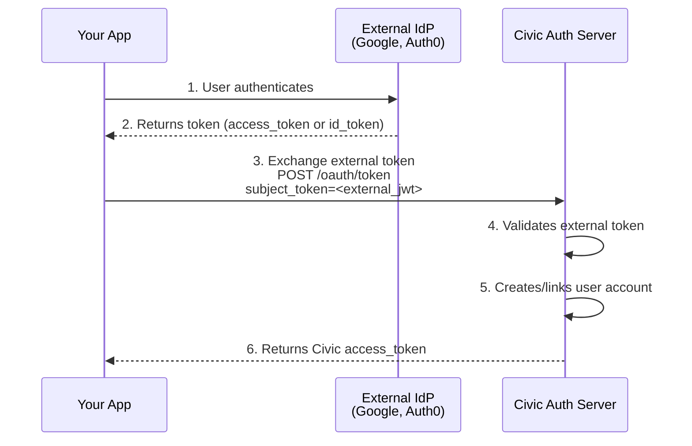

<Info>
  Token Exchange is currently in **preview**. The API and behavior may change as we continue to refine the feature.
</Info>

Token exchange allows you to exchange tokens for Civic Auth access tokens, enabling seamless integration between different authentication systems and Civic-powered applications.

Civic Auth supports two token exchange scenarios:

1. **Civic Token Exchange** - Exchange an existing Civic access token for a new token with different scopes or extended validity
2. **Federated Token Exchange** - Exchange tokens from external identity providers (Google, Auth0, Azure AD, etc.) for Civic access tokens

Both flows implement the [OAuth 2.0 Token Exchange (RFC 8693)](https://datatracker.ietf.org/doc/html/rfc8693) standard.

## Use Cases

<Tabs>
  <Tab title="Civic Token Exchange">
    **Best for:** Delegating tokens with reduced permissions

    - **Scope Reduction**: Create tokens with fewer permissions for specific tasks or services
    - **Agent Delegation**: Issue constrained tokens to AI agents or automated systems that cannot exceed their granted permissions
    - **Least Privilege**: Follow security best practices by granting only the minimum required access for each operation
  </Tab>

  <Tab title="Federated Token Exchange">
    **Best for:** Integrating external identity providers with Civic Auth

    - **Unified Authentication**: Users authenticated with Google, Auth0, or other providers can access Civic-powered services without re-authenticating
    - **Migration**: Gradually migrate users from an existing OAuth provider to Civic Auth
    - **Enterprise SSO**: Integrate with corporate identity providers (Azure AD, Okta) while using Civic for authorization
  </Tab>
</Tabs>

## Configuration

Token Exchange can be set up in the Civic Auth Dashboard under **Setup > Token Exchange**.

<Frame>
  
</Frame>

## Quick Start

### Prerequisites

1. A Civic Auth application with client credentials (client ID and secret)
2. For federated exchange: An external identity provider configured in the Civic Auth Dashboard

### Request Parameters

| Parameter | Required | Description |
|-----------|----------|-------------|
| `grant_type` | Yes | Must be `urn:ietf:params:oauth:grant-type:token-exchange` |
| `client_id` | Yes | Your Civic Auth client ID |
| `client_secret` | Yes | Your Civic Auth client secret (or use Basic auth) |
| `subject_token` | Yes | The JWT to exchange (Civic or external) |
| `subject_token_type` | Yes | `urn:ietf:params:oauth:token-type:access_token` or `urn:ietf:params:oauth:token-type:id_token` |
| `scope` | No | Space-delimited scopes to request |
| `expires_in` | No | Requested token TTL in seconds |

### Basic Token Exchange Request

```bash
curl -X POST https://auth.civic.com/oauth/token \
  -H "Content-Type: application/x-www-form-urlencoded" \
  -d "grant_type=urn:ietf:params:oauth:grant-type:token-exchange" \
  -d "client_id=YOUR_CLIENT_ID" \
  -d "client_secret=YOUR_CLIENT_SECRET" \
  -d "subject_token=EXTERNAL_OR_CIVIC_JWT" \
  -d "subject_token_type=urn:ietf:params:oauth:token-type:access_token" \
  -d "scope=openid"
```

### Response

```json
{
  "access_token": "eyJhbGciOiJSUzI1NiIsInR5cCI6IkpXVCJ9...",
  "token_type": "Bearer",
  "expires_in": 3600,
  "scope": "openid profile"
}
```

## Civic Token Exchange

Exchange an existing Civic access token for a new token with different scopes or expiration. The `sub` claim from the original token is preserved in the exchanged token.

### Configuration

Enable Civic Token Exchange by toggling it on in the Dashboard under **Setup > Token Exchange**.

### Example: TypeScript

```typescript
async function exchangeCivicToken(existingToken: string): Promise<string> {
  const response = await fetch('https://auth.civic.com/oauth/token', {
    method: 'POST',
    headers: {
      'Content-Type': 'application/x-www-form-urlencoded',
    },
    body: new URLSearchParams({
      grant_type: 'urn:ietf:params:oauth:grant-type:token-exchange',
      client_id: process.env.CIVIC_CLIENT_ID!,
      client_secret: process.env.CIVIC_CLIENT_SECRET!,
      subject_token: existingToken,
      subject_token_type: 'urn:ietf:params:oauth:token-type:access_token',
      scope: 'openid profile',
    }),
  });

  const data = await response.json();
  return data.access_token;
}
```

## Federated Token Exchange

Exchange tokens from external identity providers for Civic access tokens. Unlike Civic token exchange, the external user's `sub` is mapped to a new or existing Civic Auth user, and the resulting token contains the Civic user's `sub`.

### How It Works



### Configuration

Add one or more external identity providers in the Dashboard under **Setup > Token Exchange > Add Provider**. Select a preset (Google, Auth0, Azure AD) or choose Custom, then configure the provider settings:

| Setting | Description |
|---------|-------------|
| **Issuer URL** | The `iss` claim value from the external provider's tokens (e.g., `https://accounts.google.com`) |
| **Audience** | Expected `aud` claim value (usually your OAuth client ID at the external provider) |
| **JWKS Endpoint** | URL to fetch the provider's public keys for signature verification |
| **Static Public Key** | Alternative to JWKS: paste the provider's public key in PEM format |
| **Default Scopes** | Scopes to grant in the Civic token (space-separated) |
| **Max Token TTL** | Maximum token validity in seconds (60-86400) |

### Example: React with Google OAuth

Using a Google ID token is recommended for federated exchange — it contains identity claims (`email`, `name`, `picture`) that Civic Auth can map to the new user account.

```tsx
import { GoogleLogin } from '@react-oauth/google';
import { useState } from 'react';

function LoginButton() {
  const [civicToken, setCivicToken] = useState<string | null>(null);

  return (
    <GoogleLogin
      onSuccess={async (credentialResponse) => {
        // Exchange Google ID token for Civic token
        const response = await fetch('https://auth.civic.com/oauth/token', {
          method: 'POST',
          headers: {
            'Content-Type': 'application/x-www-form-urlencoded',
          },
          body: new URLSearchParams({
            grant_type: 'urn:ietf:params:oauth:grant-type:token-exchange',
            client_id: 'YOUR_CIVIC_CLIENT_ID',
            client_secret: 'YOUR_CIVIC_CLIENT_SECRET',
            subject_token: credentialResponse.credential!,
            subject_token_type: 'urn:ietf:params:oauth:token-type:id_token',
            scope: 'openid email',
          }),
        });

        const { access_token } = await response.json();
        setCivicToken(access_token);
      }}
    />
  );
}
```

<Info>
Google ID tokens include claims like `email`, `name`, and `picture` by default. Civic Auth automatically maps these to the user account during federated exchange, so new users are created with their profile information already populated.
</Info>

### Example: Node.js Backend

```typescript
import express from 'express';

const app = express();
app.use(express.json());

app.post('/api/exchange-token', async (req, res) => {
  const { externalToken, provider } = req.body;

  try {
    const response = await fetch('https://auth.civic.com/oauth/token', {
      method: 'POST',
      headers: {
        'Content-Type': 'application/x-www-form-urlencoded',
        'Authorization': `Basic ${Buffer.from(
          `${process.env.CIVIC_CLIENT_ID}:${process.env.CIVIC_CLIENT_SECRET}`
        ).toString('base64')}`,
      },
      body: new URLSearchParams({
        grant_type: 'urn:ietf:params:oauth:grant-type:token-exchange',
        subject_token: externalToken,
        subject_token_type: 'urn:ietf:params:oauth:token-type:id_token',
        scope: 'openid email profile',
      }),
    });

    if (!response.ok) {
      const error = await response.json();
      return res.status(response.status).json(error);
    }

    const tokens = await response.json();
    res.json(tokens);
  } catch (error) {
    res.status(500).json({ error: 'Token exchange failed' });
  }
});
```

### Provider Configuration Examples

<AccordionGroup>
  <Accordion title="Google">
    ```json
    {
      "issuer": "https://accounts.google.com",
      "audience": "1234567890-abc123.apps.googleusercontent.com",
      "jwksUri": "https://www.googleapis.com/oauth2/v3/certs",
      "acceptedAlgorithms": ["RS256"],
      "defaultScopes": "openid email",
      "maxTokenTtl": 3600
    }
    ```

    <Info>
    The `audience` should be your Google OAuth client ID.
    </Info>
  </Accordion>

  <Accordion title="Auth0">
    ```json
    {
      "issuer": "https://YOUR_TENANT.auth0.com/",
      "audience": "https://your-api.example.com",
      "jwksUri": "https://YOUR_TENANT.auth0.com/.well-known/jwks.json",
      "acceptedAlgorithms": ["RS256"],
      "defaultScopes": "openid email",
      "maxTokenTtl": 7200
    }
    ```

    <Info>
    Replace `YOUR_TENANT` with your Auth0 tenant name. The `audience` should match your Auth0 API identifier.
    </Info>
  </Accordion>

  <Accordion title="Azure AD / Microsoft Entra ID">
    ```json
    {
      "issuer": "https://login.microsoftonline.com/YOUR_TENANT_ID/v2.0",
      "audience": "api://your-app-id",
      "jwksUri": "https://login.microsoftonline.com/YOUR_TENANT_ID/discovery/v2.0/keys",
      "acceptedAlgorithms": ["RS256"],
      "defaultScopes": "openid email profile",
      "maxTokenTtl": 3600
    }
    ```

    <Info>
    Replace `YOUR_TENANT_ID` with your Azure AD tenant ID (GUID).
    </Info>
  </Accordion>

  <Accordion title="Okta">
    ```json
    {
      "issuer": "https://YOUR_DOMAIN.okta.com",
      "audience": "YOUR_CLIENT_ID",
      "jwksUri": "https://YOUR_DOMAIN.okta.com/oauth2/v1/keys",
      "acceptedAlgorithms": ["RS256"],
      "defaultScopes": "openid email profile",
      "maxTokenTtl": 3600
    }
    ```
  </Accordion>

  <Accordion title="Custom Provider">
    For providers not listed above, you'll need to obtain the following information from your provider's documentation:

    1. **Issuer URL**: The value of the `iss` claim in tokens issued by the provider
    2. **JWKS Endpoint**: Usually at `/.well-known/jwks.json` relative to the issuer
    3. **Token Format**: Ensure the provider issues JWTs (access tokens or ID tokens, not opaque tokens)

    If your provider doesn't expose a JWKS endpoint, you can use a static public key in PEM format:

    ```
    -----BEGIN PUBLIC KEY-----
    MIIBIjANBgkqhkiG9w0BAQEFAAOCAQ8AMIIBCgKCAQEA...
    -----END PUBLIC KEY-----
    ```
  </Accordion>
</AccordionGroup>

### User Account Linking

When a user performs federated token exchange for the first time, Civic Auth automatically:

1. **Creates a new user account** if no existing account matches the external user
2. **Links to an existing account** if a user with the same verified email exists (when email linking is enabled)

### Default Claim Mapping

Civic Auth automatically maps the following claims from the external token to the Civic user account:

| Claim | Type | Description |
|-------|------|-------------|
| `sub` | string | External user ID. Used as the principal identifier for user identity matching. |
| `email` | string | Lowercased. Only mapped if present in the external token. |
| `email_verified` | boolean | Only mapped if present in the external token. |
| `name` | string | Only mapped if present in the external token. |
| `picture` | string | Only mapped if present in the external token. |

The `sub` claim combined with the provider's issuer URL creates a stable identity mapping, ensuring:
- The same external user always maps to the same Civic account
- Different external users never collide
- Users can link multiple external providers to a single Civic account

## API Reference

### Token Exchange Endpoint

```
POST /oauth/token
Content-Type: application/x-www-form-urlencoded
```

#### Request Body

| Parameter | Type | Required | Description |
|-----------|------|----------|-------------|
| `grant_type` | string | Yes | `urn:ietf:params:oauth:grant-type:token-exchange` |
| `client_id` | string | Yes | Your Civic client ID |
| `client_secret` | string | Yes* | Your Civic client secret |
| `subject_token` | string | Yes | The JWT to exchange |
| `subject_token_type` | string | Yes | `urn:ietf:params:oauth:token-type:access_token` or `urn:ietf:params:oauth:token-type:id_token` |
| `scope` | string | No | Space-delimited requested scopes |
| `expires_in` | number | No | Requested token TTL in seconds |

<Note>
Client secret can alternatively be provided via HTTP Basic authentication header.
</Note>

#### Success Response

```json
{
  "access_token": "eyJhbGciOiJSUzI1NiIsInR5cCI6IkpXVCJ9...",
  "token_type": "Bearer",
  "expires_in": 3600,
  "scope": "openid email",
  "refresh_token": "optional_refresh_token"
}
```

#### Error Response

```json
{
  "error": "invalid_grant",
  "error_description": "The subject token is invalid or expired"
}
```

| Error Code | Description |
|------------|-------------|
| `invalid_request` | Missing required parameter |
| `invalid_client` | Client authentication failed |
| `invalid_grant` | Subject token is invalid, expired, or from an unconfigured provider |
| `unauthorized_client` | Client not authorized for token exchange |
| `unsupported_grant_type` | Grant type not supported |

## Security Considerations

### Token Validation

Civic Auth performs comprehensive validation on all subject tokens:

- **Signature Verification**: Tokens must be signed by the configured provider's private key
- **Issuer Validation**: The `iss` claim must exactly match the configured issuer URL
- **Audience Validation**: If configured, the `aud` claim must match
- **Expiration Check**: Tokens must not be expired
- **Algorithm Check**: Only configured algorithms are accepted (default: RS256)

### Best Practices

<CardGroup cols={2}>
  <Card title="Use HTTPS" icon="lock">
    Always use HTTPS for token exchange requests
  </Card>
  <Card title="Secure Client Secrets" icon="key">
    Store client secrets securely; never expose them in client-side code
  </Card>
  <Card title="Short Token TTLs" icon="clock">
    Request only the token validity you need
  </Card>
  <Card title="Minimal Scopes" icon="shield-check">
    Request only the scopes required for your use case
  </Card>
</CardGroup>

<Warning>
**Validate Tokens**: Always validate Civic tokens on your backend before trusting claims.
</Warning>

### JWKS Caching

Civic Auth caches external provider JWKS for performance and reliability:

- Cache TTL: 1 hour
- Automatic refresh on key rotation
- Graceful fallback during provider outages

## Troubleshooting

<AccordionGroup>
  <Accordion title='"Token exchange config not found"'>
    - Ensure the external provider is configured in the Dashboard
    - Verify the issuer URL exactly matches the `iss` claim in the token
  </Accordion>

  <Accordion title='"Signature verification failed"'>
    - Check that the JWKS endpoint is correct and accessible
    - Verify the token hasn't been tampered with
    - Ensure the provider is using one of the configured algorithms
  </Accordion>

  <Accordion title='"Token expired"'>
    - External tokens have their own expiration; exchange them promptly
    - Civic tokens respect both the external token's remaining validity and the configured max TTL
  </Accordion>

  <Accordion title='"Missing user identifier claim"'>
    - Ensure the external token contains a `sub` claim with the user's unique identifier
  </Accordion>
</AccordionGroup>

## Related Documentation

- [OAuth 2.0 Token Exchange (RFC 8693)](https://datatracker.ietf.org/doc/html/rfc8693)
- [JSON Web Key Set (RFC 7517)](https://datatracker.ietf.org/doc/html/rfc7517)
- [Authentication Flows](/overview/authentication-flows)
